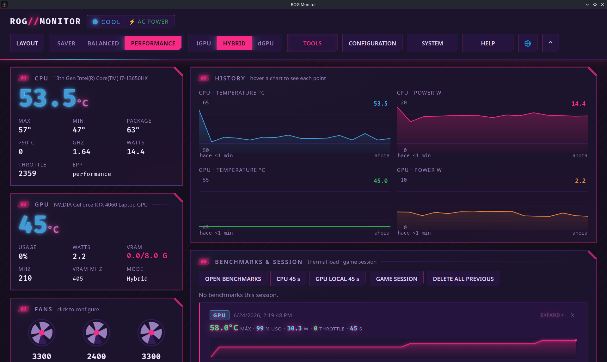
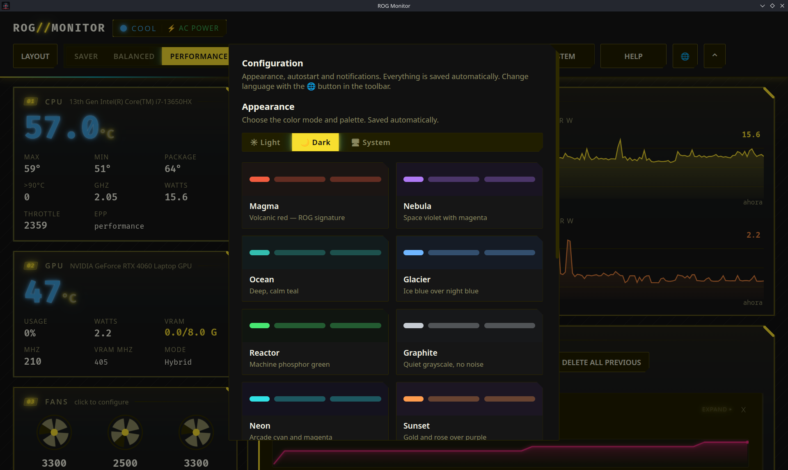
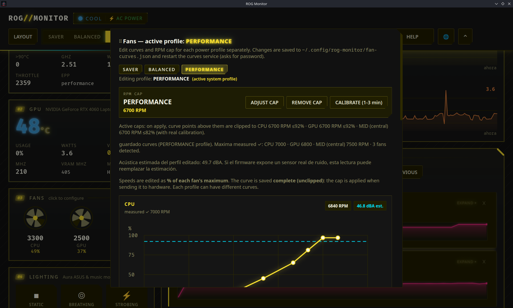
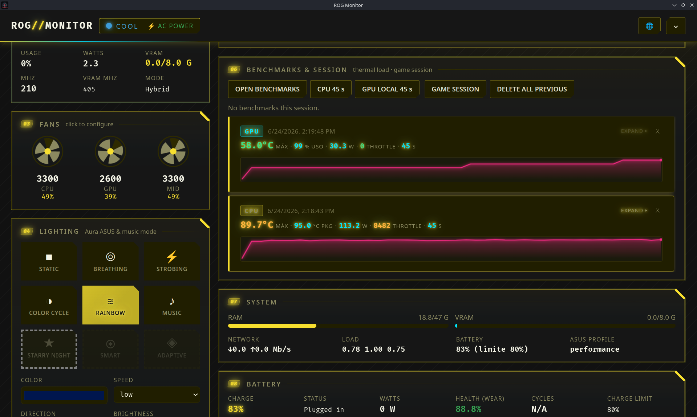
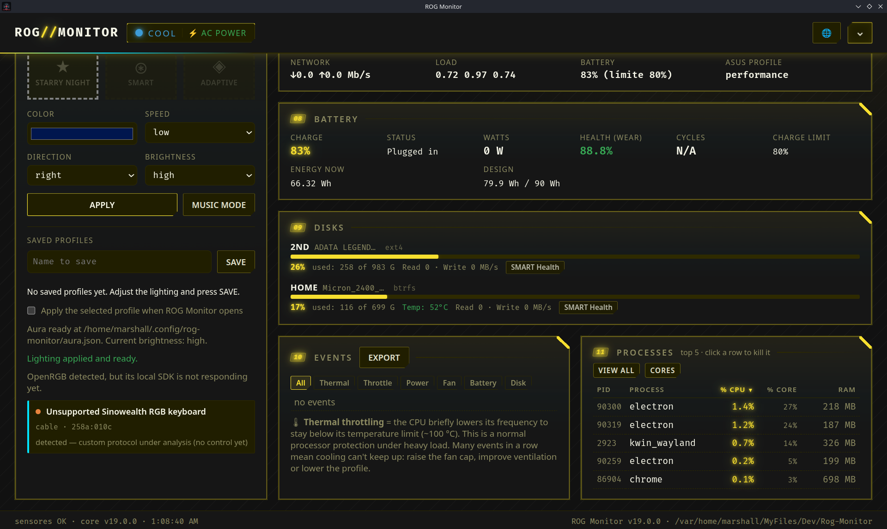
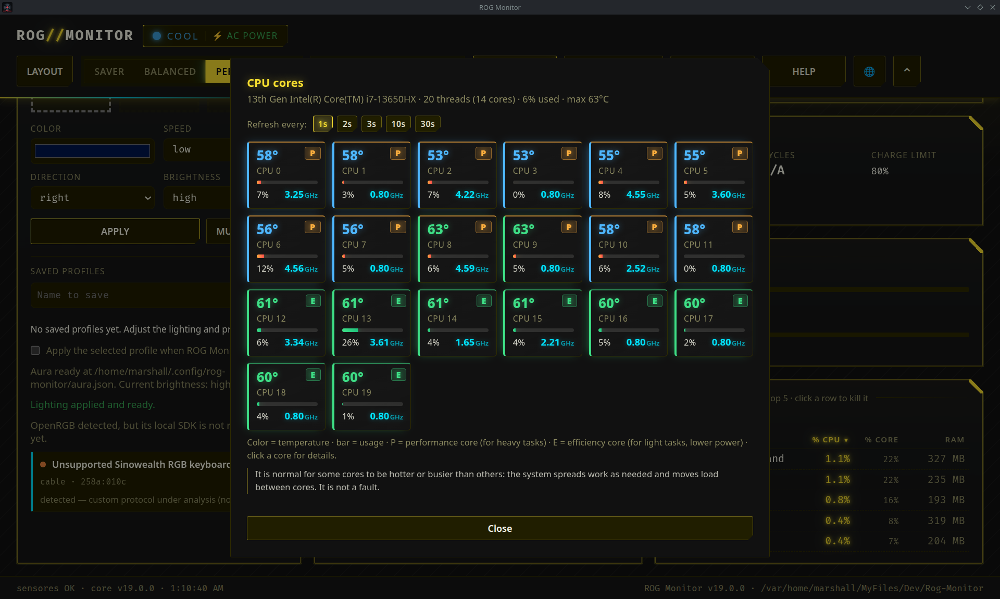
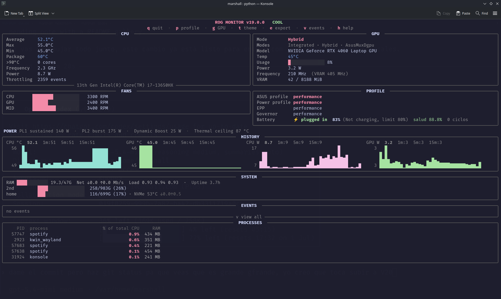

# ROG Monitor

Real-time hardware monitor and control center for ASUS ROG laptops on Linux,
available as a terminal UI and an Electron desktop app. No telemetry, no
background network calls, and no root access for the main monitoring path.

> ⚠️ **Early release — actively improving.** ROG Monitor is used daily and works,
> but it is still evolving: expect bugs, rough edges, and fast-moving features.
> **Linux only for now**. A Windows companion app is listed in the
> [roadmap](docs/roadmap.md). The project is tested mostly on ASUS ROG hardware;
> unsupported machines degrade to read-only instead of guessing. Privileged
> actions for power, fans, and firmware are designed to be reversible, but use
> them with care. Bug reports and pull requests are welcome.

```
  ╔═ 01 CPU ══════════════════╗  ╔═ 05 History ══════════════╗
  ║  Avg 58.4 °C  Pkg 69 °C  ║  ║  CPU temp ▁▃▅▇█▇▅▃▁  ▲   ║
  ║  Power     28.4 W         ║  ║  GPU temp ▂▄▆▇▇▇▆▄▂  │   ║
  ╚═══════════════════════════╝  ╚═══════════════════════════╝
  ╔═ 02 GPU ══════════════════╗  ╔═ 06 Benchmarks ═══════════╗
  ║  Mode  Hybrid             ║  ║  [BENCHMARK]  [EXPORT]    ║
  ║  RTX 4060  51 °C  Use 12% ║  ╚═══════════════════════════╝
  ╚═══════════════════════════╝
  ╔═ 03 Fans ═════════════════╗
  ║  CPU ████████░  3 300 RPM ║
  ║  GPU ██████░░░  2 600 RPM ║
  ╚═══════════════════════════╝
  ╔═ 04 Lighting ═════════════╗
  ║  [●] Rainbow  [○] Breathe ║
  ║  Bright ●●●○  [APPLY]     ║
  ╚═══════════════════════════╝
```

## Demo

<p align="center">
  
</p>

## Screenshots

Current desktop screenshots:

<table>
  <tr>
    <td align="center"><br>Dashboard</td>
    <td align="center"><br>Configuration</td>
    <td align="center"><br>Benchmarks & session</td>
  </tr>
  <tr>
    <td align="center"><br>Fans</td>
    <td align="center"><br>System & battery</td>
    <td align="center"><br>CPU cores</td>
  </tr>
  <tr>
    <td align="center" colspan="3"><br>TUI</td>
  </tr>
</table>

## Security at a glance

- **No telemetry, no background network.** The app opens no outgoing sockets.
  The only intended internet use is `git fetch` when you press **UPDATE**.
- **No root required for monitoring.** Sensors are read from sysfs/hwmon as a
  normal user.
- **Allowlisted privileged actions.** Power, fan, SMART, and service changes go
  through explicit `pkexec` prompts and bounded scripts. Polkit handles the
  password; ROG Monitor never sees or stores it.
- **Double clamp before firmware writes.** Power values are clamped by the UI and
  again by the privileged helper against firmware-reported `_min` / `_max`
  values.
- **Recovery path included.** **RESET TO FACTORY** restores firmware defaults and
  `scripts/rog-monitor-safe-mode.sh` can disable root integrations from a TTY.

Threat model and reporting process: [SECURITY.md](SECURITY.md).

## Main features

### Sensors (no root)

- **CPU**: per-core temperature, average/max/min, package temperature,
  frequency, count of cores over 90 °C, and thermal-throttling counter.
- **GPU**: NVIDIA (`nvidia-smi`) and AMD (`hwmon/amdgpu`) telemetry:
  temperature, utilization, power, VRAM, core clock, and memory clock. Detects
  Hybrid / Integrated / AsusMuxDgpu (MUX) through `supergfxctl` and handles the
  dGPU being powered down.
- **Fans**: RPM, proportional bars, real PWM-to-RPM calibration, and runtime RPM
  caps applied by the root service.
- **System**: RAM, real disks with NVMe temperature, network, load, uptime, and
  battery charge limit.
- **Processes**: top CPU and memory consumers with confirmation before closing a
  process.
- **SMART health**: `smartctl` through one explicit `pkexec` prompt.
- **FPS overlay**: MangoHud log integration, opt-in.

### Desktop app (Electron + Python)

- Numbered blocks: CPU, GPU, Fans, Lighting, History, Benchmarks, System, Events,
  and Processes.
- **Power Center**: calibrated CPU/GPU power limit control with firmware clamps.
- **12 palettes** x light/dark mode: Magma, Nebula, Ocean, Glacier, Reactor,
  Graphite, Neon, Sunset, Neon Nights, Cyberpunk, Aurora, and Dawn.
- **Interactive history charts**: hover shows the exact value and how many
  seconds ago it was recorded.
- **Gaming overlay**: transparent, frameless, always-on-top, click-through
  window for any monitor/corner.
- **First-run wizard**: detects fans, calibrates with `pkexec`, runs CPU/GPU
  benchmarks, and tours the app.
- **Four widget states**: data, loading, empty, and error.
- Draggable modals, full JSON export/import, and configurable text size.

### RGB lighting (Aura + peripherals)

- Aura grid with firmware-detected hardware modes when exposed by ASUS.
- **Music Mode**: captures system audio through PipeWire and drives Aura
  brightness/color in real time.
- Aura profiles stored in `~/.config/rog-monitor/aura.json`.
- Third-party USB RGB keyboard detection is present; write control is blocked
  until the protocol is verified.

### Power Center

ROG Monitor reads safe ranges from `asus-armoury` sysfs or from a device profile
at `~/.config/rog-monitor/device.json`. It never writes outside firmware-declared
minimum and maximum values.

| Control | Sysfs (`asus-armoury`) |
| --- | --- |
| CPU PL1 (sustained) | `ppt_pl1_spl` |
| CPU PL2 (burst) | `ppt_pl2_sppt` |
| GPU Dynamic Boost | `nv_dynamic_boost` |
| Thermal Target | `nv_temp_target` |

Safety guarantees:

1. Every write is clamped against firmware `_max` / `_min` values.
2. The Power Center shows current values before changing anything and requires
   explicit consent before applying.
3. **RESET TO FACTORY** restores firmware stock values.
4. Startup is read-only by default; the app does not change power or GPU mode on
   its own.

GPU Base Clock Offset and Memory Clock Offset use NVML when the driver supports
them. They require an extra confirmation because unstable offsets can crash the
session.

To add your own machine or tune ranges, see
[docs/supported-devices.md](docs/supported-devices.md).

### TUI (terminal)

- Rich charts without flicker, refreshed once per second.
- Semantic colors shared with the desktop app: blue = cold, green = normal,
  orange = near limit, red = critical.
- Mouse tracking that does not break scrolling.

## Installation

```bash
git clone https://github.com/MarshallGomez1103/Rog-Monitor.git
cd Rog-Monitor
bash install.sh
```

`install.sh`:

1. Creates the Python environment and the `monitor` command without sudo.
2. Installs the desktop app and launchers when Node.js/npm are available.
3. At the end, asks for sudo once for optional system integration: fan service,
   thermal guardian setup, and CPU power read permissions. You can say no.

It does not install anything that automatically changes your GPU mode or power
profile.

Run it with:

```bash
monitor            # terminal UI
monitor --desktop  # desktop app, or open it from the app launcher
```

### AppImage

Download the `.AppImage` from Releases, make it executable once, and open it:

```bash
chmod +x ROG-Monitor-*.AppImage
```

It needs `python3`, which ships with most Linux distributions. To build it
locally:

```bash
cd desktop
npm install
npm run dist
```

The output lands in `desktop/dist/`.

## Uninstall

```bash
bash uninstall.sh            # removes app, launchers, autostart and services;
                             # keeps ~/.config/rog-monitor
bash uninstall.sh --purge    # also removes configuration
```

You can also update, reinstall, or uninstall from
**System -> Maintenance** inside the app.

### TTY recovery

If a root integration causes trouble and you can only enter through a TTY
(`Ctrl+Alt+F3`):

```bash
sudo bash scripts/rog-monitor-safe-mode.sh disable
sudo bash scripts/rog-monitor-safe-mode.sh no-auto-profile
```

## TUI keys

| Key | Action |
| --- | --- |
| `q` | Quit |
| `p` | Cycle power profile (`power-saver` -> `balanced` -> `performance`) |
| `g` | Change GPU mode (`Hybrid` <-> `Integrated`); press again while pending to cancel |
| `t` | Cycle color theme |
| `v` | View full event log |
| `e` | Export history as JSON + CSV |
| `h` | Help |

## CLI

```text
monitor [--once] [--json] [--json-stream] [--desktop] [--interval S]
        [--no-gpu] [--theme THEME] [--lang en|es] [--version]
```

`--json` and `--json-stream` emit NDJSON with all sensors. The desktop app uses
that stream, and external widgets/scripts can consume it too.

## Configuration

`~/.config/rog-monitor/config.json` is created on first save:

```json
{
  "lang": "auto",
  "theme": "rog",
  "interval": 1.0,
  "history_seconds": 900,
  "notifications": true,
  "alerts": {
    "cpu_temp_warn": 92,
    "gpu_temp_warn": 85,
    "cpu_power_warn": 140,
    "fan_stopped_cpu_temp": 60,
    "cooldown_seconds": 120,
    "throttle_min_ms": 100
  },
  "temp_colors": {
    "cpu": [70, 85, 92],
    "gpu": [60, 75, 83]
  }
}
```

`temp_colors` defines personal temperature bands: `[green_before,
yellow_before, orange_before]`. Above the last value, the UI turns red.

These values are editable from the desktop app's **ALERTS** modal.

## Supported hardware

### Calibrated profiles

The repo includes community-calibrated profiles and can also read live firmware
ranges from sysfs. Public profiles must avoid personal data and use only the
technical identifiers needed to detect the device.

### Generic sensors

The sensor layer enumerates hwmon directly. Any machine exposing standard chips
works without extra configuration:

- **CPU**: `coretemp` (Intel), `k10temp` / `zenpower` (AMD)
- **GPU**: NVIDIA through `nvidia-smi`; AMD through `amdgpu` hwmon
- **Fans**: any chip exposing `fan*_input`
- **Power profiles**: `asus-wmi` / `asus-armoury`, with a generic
  `platform_profile` fallback

Missing sensors degrade quietly to `N/A`.

### Add your machine

See [docs/supported-devices.md](docs/supported-devices.md) for:

- Reading safe ranges from `asus-armoury` sysfs or Armoury Crate on Windows.
- The schema for `src/rog_monitor/device_profiles.json`.
- Creating a local profile at `~/.config/rog-monitor/device.json`.
- Current public model support.

## No telemetry, no network

No data is sent to any server. The only allowed network actions are the update
button (`git fetch` on your own clone) and the report button, which opens GitHub
with system information pre-filled. ROG Monitor never runs `git push`.

## License

MIT
